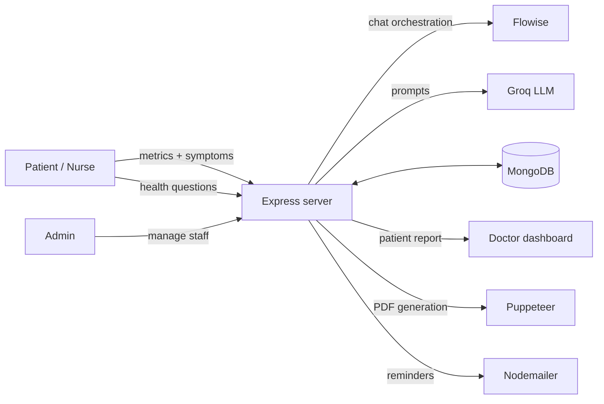

# AfyaSphere

**An AI-assisted health platform that connects patients, nurses, and doctors: record vitals and symptoms, get AI-supported guidance, and send clear patient reports to a doctor.**

AfyaSphere , my final-year Computer Science project at Kenyatta University. 
simple question: *how do we keep people informed about their health, and give clinicians the information they need faster?* Patients record their metrics and symptoms and can ask health questions to an AI assistant. A structured report then goes to a doctor, who can manage patients, appointments, and reports from a single dashboard.

> **Disclaimer:** AfyaSphere is an academic prototype, not a medical device. AI output is informational decision support. It is not a diagnosis and does not replace a qualified healthcare professional.

---

## Features

### For patients
- **Health metrics tracking:** record temperature, blood pressure, respiratory rate, and pulse rate.
- **Symptom checker:** describe symptoms and receive AI-suggested possible conditions, each with a short reasoning.
- **AI health assistant:** ask health questions in a chat and get answers. Conversations are saved per user and can be resumed, with one-line summaries of each chat.
- **Health tips:** AI-generated tips shown inside the app.
- **Reports:** generate a patient report (metrics, symptoms, possible conditions) and download it as a PDF.
- **Appointments and reminders:** book a session with an available doctor, manage events on a calendar, and receive email reminders (a scheduled job runs every morning at 07:00).
- **History:** review past chats, symptom entries, and reports.

### For nurses
- Assist a patient through a dedicated nurse login, adding an assessment to the report. The assessment is summarised by AI into one sentence for the doctor.

### For doctors
- Dashboard of assigned patients and incoming reports, with each patient's recent history.
- Read the patient's report, including metrics, symptoms, AI-suggested conditions, and the nurse's assessment.
- Set availability and dates, accept or cancel appointments, and complete a report after review.
- A faster way to review a case before or during a consultation, which is the project's main aim.

### For administrators
- Register and remove doctors and nurses (with profile photos) and view an overview of the platform's users.

---

## AI components

| Where | What it does | How |
|---|---|---|
| Patient chat | Answers health questions and keeps conversational context | Flowise chatflow (orchestration) |
| Symptom checker | Suggests possible conditions from metrics and symptoms, then extracts a clean list of conditions | Groq-hosted LLM via prompt chains |
| Summaries | One-sentence summaries of chats and of nurse assessments | Groq `llama-3.3-70b-versatile` |
| Doctor profiles | Short descriptions of a doctor's specialty | Groq `llama-3.3-70b-versatile` |
| Reminders | Drafts reminder emails for upcoming events | LLM prompt |

Prompts are written to avoid naming causes or diseases in chat summaries, and to end answers by inviting the user to ask follow-up questions.

---

## How it works



**Typical flow:** the patient (optionally assisted by a nurse) records vitals and symptoms, the symptom checker produces AI-suggested conditions, the report is sent to a chosen doctor, and the doctor reviews it from the dashboard, then manages the appointment.

---

## Tech stack

- **Backend:** Node.js, Express, EJS templates
- **Database:** MongoDB (native driver)
- **AI:** Groq SDK (Llama 3.3 70B), Flowise orchestration
- **Auth:** Passport.js (Google OAuth 2.0 and local strategies), `bcrypt`, `express-session`
- **Frontend:** HTML, CSS, vanilla JavaScript, FullCalendar, Chart.js
- **Reports and notifications:** Puppeteer / PDFKit (PDF), Nodemailer (email), node-cron (scheduled jobs)
- **Uploads:** Multer

---

## Project structure

```
health_bot/
├── server.js            # App entry: sessions, routes, scheduled jobs, AI endpoints
├── config/              # Database, Passport strategies, shared LLM helper
├── routes/              # user.js (patients), doctors.js, google.js (auth/registration), admin.js
├── middleware/          # Authentication guard
├── views/               # EJS pages (chat, symptom checker, records, events, doctor, admin)
├── public/              # Client-side scripts, styles, logos
├── images/              # Uploaded profile photos
└── playgrounds/         # MongoDB playground scripts
```

**MongoDB collections:** `users`, `doctors`, `nurses`, `administrator`, `allmetrics`, `reports`, `docreports`, `docappointments`, `events`, `history`, `data` (chat sessions), `tips`.

---

## Getting started

### Prerequisites
- Node.js 18+
- A MongoDB database (local or Atlas)
- A [Groq](https://console.groq.com) API key
- A Google OAuth client (for Google sign-in)
- A running [Flowise](https://flowiseai.com) chatflow for the health assistant

### Setup

```bash
git clone https://github.com/spencers20/health_bot.git
cd health_bot
npm install
```

Create a `.env` file in the project root:

```env
MONGO_URI=your_mongodb_connection_string
SECRET_KEY=a_long_random_session_secret
GOOGLE_CLIENT_ID=your_google_client_id
GOOGLE_CLIENT_SECRET=your_google_client_secret
GROQ_API_KEY=your_groq_api_key
NODE_ENV=development
```

Before running, point the app at your own services:
- **Flowise:** set your chatflow's prediction endpoint in `sendToFLowise` (`routes/user.js`).
- **Email:** configure the Nodemailer transport in `config/database.js` with your own sender account.
- **Google OAuth:** set the callback URL (default `http://localhost:3000/google/callback`) in your Google console and `config/passport.js`.

### Run

```bash
npm run dev     # development, with nodemon
npm start       # production
```

The app serves on `http://localhost:3000`.

---

## Screenshots

_Add screenshots here: patient dashboard, symptom checker, AI chat, doctor dashboard, generated PDF report._

---

## Roadmap

- Link AfyaSphere with hospital systems so a patient's records follow them across facilities
- Push updates to doctors as reports arrive, instead of on refresh
- Move service endpoints and credentials fully into environment variables
- Add authorization checks to every admin and data endpoint
- Add automated tests and an API reference
- Evaluate AI suggestions against clinical references, with clearer confidence and safety messaging

---

## Author

**Spencer Nyaenya**: AI Engineer, Nairobi, Kenya
[GitHub](https://github.com/spencers20) · 

## License

ISC
